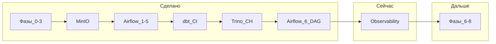

# Карта курса лаборатории (одна страница)

Сводный маршрут Senior DevOps / DataOps на VirtualBox + k3s. Детали — в [`план-практики-инфраструктура-senior-devops.md`](./план-практики-инфраструктура-senior-devops.md) и программах обучения ниже.

**Обновлено:** 2026-07-14 (Airflow §6.6 закрыт — один DAG до `end` зелёный).

---

## На завтра / ближайшая сессия

**Старт:** «продолжаем **Фаза 5** — observability» (§0 в [`программа-обучения-sentry-prometheus-statsd.md`](./программа-обучения-sentry-prometheus-statsd.md)).

Не повторять: Airflow 1–5, dbt A–D, §6.6.

| Шаг | Действие | Критерий «готово» |
| --- | --- | --- |
| 1 | §0 — роли метрик / логов / ошибок в data-path | Устно: что смотрим в Prometheus vs Sentry |
| 2 | Трек E/F — StatsD и/или Prometheus baseline | Job/values + smoke метрик в лаборатории |

---

## Легенда

| Символ | Значение |
| --- | --- |
| ✅ | Сделано |
| 🔄 | В работе (текущая точка) |
| ⏳ | Дальше по маршруту |
| — | Только фаза плана, отдельной программы обучения пока нет |

---

## Сейчас: ближайшие шаги

1. **Фаза 5** — Prometheus / StatsD / Sentry ([`программа-обучения-sentry-prometheus-statsd.md`](./программа-обучения-sentry-prometheus-statsd.md)).
2. Затем фазы 6–8 (DR, безопасность, упаковка под интервью).

---

## Сводка по фазам плана

| Блок | Содержание | Статус | Детали |
| --- | --- | --- | --- |
| **0–3** | GitLab, Runner, k3s, Helm, CI quality gates, SLO | ✅ | План §«Сделано», трекинг фазы 0–3 |
| **4a** | MinIO, Airflow (уроки 1–5, MinIO в DAG) | ✅ | [`программа-обучения-airflow.md`](./программа-обучения-airflow.md) |
| **4b** | dbt → Trino → ClickHouse → E2E data-path | ✅ | Треки A–D, CI smoke/publish, DAG `raw→staging` (2026-06-03) |
| **4c** | Airflow §6: оркестрация dbt/Trino/CH | ✅ | §6.1–6.6 ✅ (2026-07-14); DAG до `end` зелёный |
| **5** | Prometheus, StatsD, Sentry, data-SLI | 🔄 | [`программа-обучения-sentry-prometheus-statsd.md`](./программа-обучения-sentry-prometheus-statsd.md) |
| **6–8** | DR, безопасность, упаковка под интервью | ⏳ | План фазы 6–8 |

---

## Прогресс по программам обучения

| Программа | Прогресс | Статус блоков |
| --- | --- | --- |
| [Airflow](программа-обучения-airflow.md) | **19 / 19** | §1–6 ✅ (runbook + §6.6 E2E в DAG) |
| [dbt / ClickHouse / Trino](программа-обучения-dbt-clickhouse-trino.md) | **34 / 35** | §0 ✅ · **A–D ✅** (опц. `dbt docs`) |
| [Prometheus / StatsD / Sentry](программа-обучения-sentry-prometheus-statsd.md) | **0 / ~20** | §0 🔄 · E–H ⏳ |

### Airflow (детально)

| Раздел | Статус |
| --- | --- |
| 1. Смысл | ✅ |
| 2. Устройство | ✅ |
| 3. Пользователь DAG | ✅ |
| 4. Администратор | ✅ |
| 5. MinIO | ✅ |
| 6.1–6.3 Сквозной (база) | ✅ |
| 6.4 Ретраи на внешних шагах | ✅ |
| 6.5 Runbook | ✅ |
| **6.6** dbt + Trino + CH в DAG | ✅ **2026-07-14** |

### dbt / ClickHouse / Trino (детально)

| Трек | Статус |
| --- | --- |
| §0 Роли data-path | ✅ |
| A dbt | ✅ (2026-05-19) |
| B Trino | ✅ (2026-06-03) |
| C ClickHouse | ✅ (2026-06-03) |
| D Сквозной E2E | ✅ (2026-06-03) |

### Observability (детально)

| Трек | Статус |
| --- | --- |
| §0 Роли сигналов | 🔄 |
| E StatsD | ⏳ |
| F Prometheus | ⏳ |
| G Sentry | ⏳ |
| H Сквозной observability | ⏳ |

---

## Трекинг плана (фазы 0–8)

| Фаза | Статус в плане | Срок (план) |
| --- | --- | --- |
| 0 | Завершено | неделя 1 |
| 1 | Завершено | недели 2–3 |
| 2 | Завершено | недели 4–5 |
| 3 | Завершено | недели 6–7 |
| 4 | **Завершено** (data-path + AF §6) | недели 8–10 |
| 5 | **В работе** | недели 10–12 |
| 6 | Не начато | недели 12–14 |
| 7 | Не начато | недели 14–15 |
| 8 | Не начато | неделя 16+ |

Полная таблица с датами и кейсами: план §«Трекинг прогресса».

---

## Как обновлять эту карту

1. Закрыли чеклист в программе обучения — обновите строку в таблице «Прогресс по программам» и при необходимости «Сводку по фазам».
2. Закрыли фазу целиком — строка в **трекинге плана** + 1–3 пункта в [`резюме-черновик.md`](./резюме-черновик.md) по [`правила-ведения-плана-и-резюме.md`](./правила-ведения-плана-и-резюме.md).

---

## Ссылки

| Документ | Назначение |
| --- | --- |
| [`план-практики-инфраструктура-senior-devops.md`](./план-практики-инфраструктура-senior-devops.md) | Фазы, инфраструктура, трекинг |
| [`резюме-черновик.md`](./резюме-черновик.md) | Компетенции и кейсы |
| [`подготовка-к-собеседованию-dataops.md`](./подготовка-к-собеседованию-dataops.md) | Формулировки для интервью |
