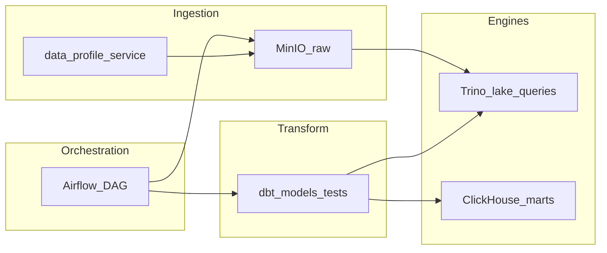

# Программа обучения: dbt / ClickHouse / Trino (лаборатория)

Документ фиксирует **маршрут изучения** трансформаций и аналитических движков в связке с общим планом [`план-практики-инфраструктура-senior-devops.md`](./план-практики-инфраструктура-senior-devops.md) (**Фаза 4**: MinIO, Airflow, dbt, ClickHouse, Trino).

**Карта всего курса:** [`карта-курса-лаборатории.md`](./карта-курса-лаборатории.md).

**Предусловия:** MinIO с buckets `raw` / `staging` / `marts`; базовый трек Airflow (уроки 1–5) в [`программа-обучения-airflow.md`](./программа-обучения-airflow.md); понимание Connections/Variables и паттерна `raw → staging`.

**Связанные документы:** [`platform-service/docs/data-path-minimum.md`](../../platform-service/docs/data-path-minimum.md), [`программа-обучения-airflow.md`](./программа-обучения-airflow.md) (раздел 6 — возврат после этого курса), [`правила-ведения-плана-и-резюме.md`](./правила-ведения-плана-и-резюме.md).

**Целевые артефакты в репозитории:** `platform-service/dbt/` и job **`validate_dbt`** — добавлены; `helm/trino/`, `helm/clickhouse/`, runbook'и — дальше по трекам B/C.

**Порядок треков:** A (dbt) → B (Trino) → C (ClickHouse) → D (сквозной сценарий) → возврат в Airflow (раздел 6).

---

## Журнал уроков

Заполняйте по шаблону: **дата**, **трек/§**, **что сделано**, **артефакт** (коммит / run id / revision Helm), **критерий закрытия**.

### Шаблон урока

```text
### Урок N (статус: в работе | закрыт)
Трек A/B/C/D, § …
Сделано: …
Артефакт: …
Критерий: …
```

### Урок A.1 (закрыт, 2026-05-19)

**Смысл:** dbt держит SQL-трансформации, тесты и lineage в Git; Airflow только оркестрирует `dbt run`, не дублирует бизнес-SQL в DAG.

**Формулировка для себя:** «MinIO и Airflow двигают данные по слоям; dbt описывает, *как* raw становится staging/marts, с проверками на MR».

**Артефакт:** [`platform-service/docs/dbt-baseline.md`](../../platform-service/docs/dbt-baseline.md), каталог `platform-service/dbt/`.

### Урок A.2–A.5 (в работе)

Скелет проекта и CI `validate_dbt` в репозитории; закрыть чеклист A после зелёного pipeline и локального `dbt test`.

*(Базовый трек Airflow закрыт 2026-05-15 — см. [`программа-обучения-airflow.md`](./программа-обучения-airflow.md).)*

---

## 0. Роли в data-path (0.5 дня)

| Компонент | Ответственность в лаборатории |
| --- | --- |
| MinIO | Слои `raw` / `staging` / `marts`; S3-совместимое хранилище |
| Airflow | Оркестрация: расписание, зависимости, ретраи, вызов внешних шагов |
| **dbt** | SQL-трансформации, тесты качества, lineage, `dbt docs` |
| **Trino** | Federated SQL, запросы к lake/таблицам поверх MinIO (catalog) |
| **ClickHouse** | Колоночное OLAP-хранилище витрин (`marts`), быстрые агрегаты |



**Критерий:** одной схемой объясняете путь `raw → staging → marts` и границу «кто оркестрирует / кто трансформирует / кто хранит витрины».

---

## Трек A — dbt (≈4–6 дней)

### A1. Смысл продукта (0.5–1 день)

| Тема | Содержание |
| --- | --- |
| Роль dbt | Версионируемые SQL-модели, граф зависимостей (`ref`), тесты на данных |
| Базовые сущности | Project, profile, model, source, test, snapshot (концепт) |
| Отличие от SQL в DAG | Бизнес-логика и quality gates в репозитории dbt; Airflow только запускает `dbt run` / job |

**Критерий:** одной фразой объясняете, зачем выносить трансформации из Airflow в dbt.

### A2. Как это устроено (1 день)

| Тема | Содержание |
| --- | --- |
| Структура проекта | `dbt_project.yml`, каталоги `models/`, `macros/`, `tests/` |
| Profiles | Подключение к целевому движку (Trino или ClickHouse — после деплоя); секреты вне Git |
| Adapter | `dbt-trino` / `dbt-clickhouse` — выбор после поднятия движка в треках B/C |
| Materializations | `view`, `table`, `incremental` — когда что уместно в лаборатории |

**Критерий:** находите в проекте model, source и profile без шпаргалки.

### A3. Разработчик моделей (2–3 дня)

| Тема | Содержание |
| --- | --- |
| Source на raw | `sources.yml` для слоя ingestion (MinIO/таблица — по выбранному adapter) |
| Модель staging | `raw` → `staging`: нормализация, типы, дедупликация (упрощённо) |
| schema.yml | Описание колонок, `not_null`, `unique`, accepted_values |
| Идемпотентность | Повторный `dbt run` не ломает данные; осмысленные ключи/партиции |

**Критерий:** одна staging-модель и минимум один generic test проходят локально или в CI.

### A4. CI и практики Senior (1 день)

| Тема | Содержание |
| --- | --- |
| Gates на MR | `dbt compile`, `dbt test` до merge (аналог quality gates Фазы 3) |
| Секреты | Credentials в GitLab CI Variables (masked), не в `profiles.yml` в Git |
| Документация | `dbt docs generate` — lineage для интервью и ревью |
| Идемпотентность в CI | Один и тот же pipeline на повторном прогоне даёт предсказуемый результат |

**Критерий:** MR с изменением модели не сливается без зелёного `dbt test`.

### A5. Лаборатория (1–2 дня)

| Тема | Содержание |
| --- | --- |
| Размещение | Каталог `platform-service/dbt/` (или отдельный репозиторий — зафиксировать в журнале) |
| CI | Планируемый job `validate_dbt` (`compile` + `test`) в `.gitlab-ci.yml` |
| Связь с buckets | Согласование имён слоёв `raw` / `staging` / `marts` с MinIO и target-движком |
| Запуск из Airflow | Концепт: `BashOperator` / `KubernetesPodOperator` с `dbt run --select …` (полная связка — в разделе 6 Airflow) |

**Критерий трека A:** минимум **1 модель + 1 тест** в CI; результат читается в target (staging в движке или согласованная таблица).

---

## Трек B — Trino (≈3–5 дней)

### B1. Смысл продукта (0.5 дня)

| Тема | Содержание |
| --- | --- |
| Роль Trino | Распределённый SQL-движок; federated queries по каталогам |
| Базовые сущности | Coordinator, worker, catalog, schema, table |
| Место в стеке | «Универсальный» SQL над lake (MinIO + metastore/catalog); не замена ClickHouse для тяжёлых витрин |

**Критерий:** объясняете, чем Trino отличается от ClickHouse в вашей лаборатории.

### B2. Как это устроено (1 день)

| Тема | Содержание |
| --- | --- |
| Catalog | Подключение к Hive Metastore / Iceberg / MinIO (упрощённый MVP лаборатории) |
| Запрос | Парсинг → план → выполнение на workers |
| Ресурсы | Память coordinator/worker — главный лимит на стенде 16 vCPU / 64 GB RAM |

**Критерий:** схема «клиент → coordinator → catalog → storage» без шпаргалки.

### B3. Пользователь SQL (1–2 дня)

| Тема | Содержание |
| --- | --- |
| CLI / UI | `trino` CLI или веб-клиент (если включён в chart) |
| Обзор данных | `SHOW CATALOGS`, `SHOW SCHEMAS`, `DESCRIBE` |
| Запросы | `SELECT` по `raw` / `staging`; `EXPLAIN` для одного тяжёлого запроса |
| Ошибки | Таймаут, нехватка памяти — читать лог coordinator |

**Критерий:** выполнен проверочный `SELECT` по данным, лежащим в MinIO (через catalog).

### B4. Администратор платформы (1–2 дня)

| Тема | Содержание |
| --- | --- |
| Развёртывание | Helm chart, namespace (например `data-platform-query`), values-dev |
| Ingress / hosts | Endpoint для CLI с рабочей станции (`*.lab.local`) |
| Ресурсы | Умеренные `requests`/`limits`; диагностика OOM (`kubectl describe pod`) |
| Операции | Перезапуск coordinator, проверка catalog config |

**Критерий:** после `helm upgrade --wait` знаете, куда смотреть при «query failed» / OOM.

### B5. Интеграция (0.5–1 день)

| Тема | Содержание |
| --- | --- |
| Airflow | `TrinoOperator` или `PythonOperator` с `trino` client — smoke SELECT |
| dbt | Adapter `dbt-trino`, если Trino выбран target для staging-моделей |
| Граница | Trino для ad-hoc и lake-запросов; витрины с жёстким SLA — ClickHouse (трек C) |

**Критерий трека B:** catalog зафиксирован в runbook; из Trino читаются данные из слоя `raw` или `staging`.

---

## Трек C — ClickHouse (≈3–5 дней)

### C1. Смысл продукта (0.5 дня)

| Тема | Содержание |
| --- | --- |
| Роль ClickHouse | Колоночное OLAP-хранилище; быстрые агрегаты и витрины |
| Базовые сущности | Database, table, engine (MergeTree), partition, ORDER BY |
| Место в стеке | Слой `marts` / витрины; Trino — исследование lake, CH — отдача аналитике |

**Критерий:** объясняете, когда писать витрину в ClickHouse, а когда достаточно Trino.

### C2. Как это устроено (1 день)

| Тема | Содержание |
| --- | --- |
| MergeTree | Партиции, сортировка, первичный ключ (упрощённо) |
| Single node | В лаборатории без репликации; HA — только концепт для интервью |
| Хранение | PVC в k8s; отличие «таблица CH» vs «объект в bucket marts» |

**Критерий:** понимаете связь `ORDER BY` и типовых запросов к витрине.

### C3. Пользователь SQL (1–2 дня)

| Тема | Содержание |
| --- | --- |
| DDL | `CREATE DATABASE`, `CREATE TABLE` с `MergeTree` |
| DML | `INSERT`, `SELECT`, простой `GROUP BY` для витрины |
| Клиент | `clickhouse-client`, DBeaver или HTTP-интерфейс |
| Качество | Сверка row count / ключей с staging после dbt |

**Критерий:** создана таблица витрины и выполнен осмысленный агрегирующий запрос.

### C4. Администратор платформы (1–2 дня)

| Тема | Содержание |
| --- | --- |
| Развёртывание | Helm, namespace (например `data-platform-warehouse`) |
| Пользователи | Отдельный пользователь для dbt/Airflow; пароль в CI Variables |
| Диагностика | Логи pod, диск PVC, `system.tables` |
| Runbook | «ClickHouse не отвечает» — 5–7 шагов (черновик в `docs/`) |

**Критерий:** deploy воспроизводим по runbook; знаете команды диагностики.

### C5. Интеграция (0.5–1 день)

| Тема | Содержание |
| --- | --- |
| dbt | Adapter `dbt-clickhouse`, materialization `table` / `incremental` для marts |
| MinIO vs CH | Bucket `marts` для файлов; таблицы CH для SQL-витрин — не смешивать без причины |
| Airflow | Шаг публикации / проверки витрины после `dbt run` |

**Критерий трека C:** витрина в ClickHouse согласована со staging; есть черновик runbook.

---

## Трек D — сквозной мини-проект (1–2 дня)

Перед возвратом в [`программа-обучения-airflow.md`](./программа-обучения-airflow.md) (раздел 6).

| Шаг | Действие | Критерий |
| --- | --- | --- |
| 1 | Объект или файл в MinIO `raw` | Виден в UI MinIO / через `aws s3 ls` |
| 2 | dbt: `raw` → `staging` + test | `dbt test` зелёный |
| 3 | Trino: проверочный `SELECT` | Результат совпадает с ожиданием по staging |
| 4 | ClickHouse: витрина в `marts` | Агрегат или денормализованная таблица |
| 5 | (После возврата в Airflow) DAG оркестрирует шаги 2–4 | Пункты **6.4–6.5** чеклиста Airflow |

**Критерий трека D:** MVP из [`data-path-minimum.md`](../../platform-service/docs/data-path-minimum.md) — отметки в чеклисте ниже, без переноса в резюме до фактического выполнения.

---

## Ограничения стенда

- Хост: **16 vCPU / 64 GB RAM**; k3s на `vm-k8s` — не раздувать replicas Trino/ClickHouse.
- **Single-instance** для MVP; HA и шардирование — только для обсуждения на интервью.
- Trino и ClickHouse **оба** должны участвовать в пайплайне до закрытия Фазы 4; если RAM не хватает — **сначала один движок**, второй с явной записью в журнале уроков (дата отложенного деплоя).
- Урок Airflow про OOM применим и здесь: задавать `requests`/`limits`, смотреть Events и `kubectl top pod`.

---

## Чеклист прогресса

Отмечайте по мере выполнения (`[x]` / `[ ]`).

### Раздел 0. Роли в data-path

- [x] Прочитан раздел 0; можете нарисовать/проговорить путь `raw → staging → marts`.
- [x] Понятна граница Airflow / dbt / Trino / ClickHouse.

### Трек A — dbt

- [x] **A.1** — объяснена роль dbt vs SQL в DAG.
- [x] **A.2** — найдены `dbt_project.yml`, profile, каталог `models/`.
- [x] **A.3** — объявлен `source` на raw; есть staging-модель.
- [x] **A.3** — в `schema.yml` минимум один generic test (`not_null` или `unique`).
- [x] **A.4** — на MR gate `validate_dbt` (`seed` + `run` + `test` + `compile`).
- [x] **A.4** — credentials не лежат в Git (DuckDB MVP; Trino/CH — позже в CI Variables).
- [x] **A.5** — проект в `platform-service/dbt/`.
- [ ] **A.5** — зелёный CI `validate_dbt` или локальный `dbt test` (проверить после push).
- [ ] (Опционально) **A.4** — сгенерированы `dbt docs` и просмотрен lineage.

### Трек B — Trino

- [ ] **B.1** — объяснено отличие Trino от ClickHouse в лаборатории.
- [ ] **B.4** — Trino развёрнут в k3s (Helm / manual CI); поды Running.
- [ ] **B.2** — catalog на MinIO/lake описан в runbook или журнале.
- [ ] **B.3** — выполнен `SHOW SCHEMAS` / `SELECT` по raw или staging.
- [ ] **B.3** — для одного запроса просмотрен `EXPLAIN`.
- [ ] **B.4** — зафиксированы endpoint и команды диагностики (OOM/timeout).
- [ ] **B.5** — smoke-запрос из Airflow или скрипта (можно после возврата в Airflow §6).

### Трек C — ClickHouse

- [ ] **C.1** — объяснено, когда витрина в CH, а когда достаточно Trino.
- [ ] **C.4** — ClickHouse развёрнут в k3s; под и PVC в порядке.
- [ ] **C.3** — создана таблица MergeTree для витрины `marts`.
- [ ] **C.3** — выполнен агрегирующий `SELECT` по витрине.
- [ ] **C.4** — пользователь/пароль для dbt или Airflow не в Git.
- [ ] **C.5** — dbt-модель или ETL-шаг пишет/обновляет витрину в CH.
- [ ] **C.4** — черновик runbook «ClickHouse не отвечает» (5+ шагов).

### Трек D — сквозной сценарий

- [ ] **D.1** — данные в `raw` без ручных правок в обход пайплайна.
- [ ] **D.2** — dbt довёл данные до `staging` с проходящими тестами.
- [ ] **D.3** — Trino подтверждает данные staging/lake.
- [ ] **D.4** — витрина доступна в ClickHouse.
- [ ] **D.5** — отмечено в журнале: готовность к Airflow §6 (пункты 6.4–6.5).

### MVP data-path (сверка с data-path-minimum)

- [ ] MinIO: buckets `raw/staging/marts` (уже сделано на предыдущих шагах Фазы 4).
- [ ] Airflow DAG по расписанию/вручную (базовый трек).
- [ ] Минимум 1 dbt-модель и 1 dbt-test.
- [ ] Данные из `raw` в `staging` без ручных правок.
- [ ] Runbook после сбоя DAG/dbt/job (можно объединить с Airflow 6.5).

---

## Возврат в Airflow

После закрытия треков A–D (или параллельно с D.5):

1. Откройте [`программа-обучения-airflow.md`](./программа-обучения-airflow.md), **раздел 6** и чеклист **6.1–6.5**.
2. **Не перечитывайте** разделы 1–5 с нуля — дополните существующий DAG:
   - вызов `dbt run` (`BashOperator` / `KubernetesPodOperator`);
   - задача с проверкой через Trino;
   - задача публикации/проверки витрины в ClickHouse.
3. Закройте **6.4** (ретраи на внешних шагах) и **6.5** (runbook в `platform-service/docs/` или приложение к программе Airflow).

**Связь с общим планом:** завершение Фазы 4 по пунктам «dbt + ClickHouse + Trino в пайплайне» и интеграции с GitLab CI для артефактов моделей/DAG.

**Следующий курс (Фаза 5):** [`программа-обучения-sentry-prometheus-statsd.md`](./программа-обучения-sentry-prometheus-statsd.md) — Prometheus, StatsD, Sentry.

---

## Обновление трекинга

После закрытия чеклистов треков A–D и возврата в Airflow §6:

- обновите таблицу **«Трекинг прогресса»** в [`план-практики-инфраструктура-senior-devops.md`](./план-практики-инфраструктура-senior-devops.md);
- строки **dbt** и **ClickHouse / Trino** в [`резюме-черновик.md`](./резюме-черновик.md) — **только по фактам** ([`правила-ведения-плана-и-резюме.md`](./правила-ведения-плана-и-резюме.md)).
