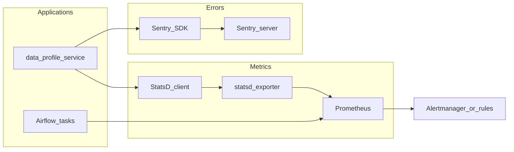

# Программа обучения: Prometheus / StatsD / Sentry (лаборатория)

Документ фиксирует **маршрут изучения** observability-стека в связке с общим планом [`план-практики-инфраструктура-senior-devops.md`](./план-практики-инфраструктура-senior-devops.md) (**Фаза 5**: метрики, ошибки, data-SLI/SLO).

**Карта всего курса:** [`карта-курса-лаборатории.md`](./карта-курса-лаборатории.md).

**Предусловия:** рабочий k3s-контур; желательно закрыта или близка к закрытию **Фаза 4** ([`программа-обучения-dbt-clickhouse-trino.md`](./программа-обучения-dbt-clickhouse-trino.md) + возврат в Airflow §6) — чтобы вешать метрики и алерты на реальный data-path (Airflow, MinIO, сервисы).

**Связанные документы:** [`platform-service/docs/slo-sla.md`](../../platform-service/docs/slo-sla.md), [`подготовка-к-собеседованию-dataops.md`](./подготовка-к-собеседованию-dataops.md) (блок observability), [`правила-ведения-плана-и-резюме.md`](./правила-ведения-плана-и-резюме.md).

**Целевые артефакты** (по мере прохождения, без выдуманного «уже сделано»): `helm/prometheus/`, `helm/statsd-exporter/` или sidecar, интеграция SDK Sentry в `data-profile-service`, дашборды/алерты, runbook'и в `platform-service/docs/`.

**Порядок треков:** E (StatsD) → F (Prometheus) → G (Sentry) → H (сквозной observability data-platform).

**Заметка про Grafana:** в плане Фазы 5 визуализация часто идёт через Grafana поверх Prometheus; в этой программе фокус на **источниках сигналов** (StatsD, scrape Prometheus, Sentry). Grafana подключайте в треке F как слой отображения (опциональный чеклист).

---

## Журнал уроков

Заполняйте по шаблону: **дата**, **трек/§**, **что сделано**, **артефакт**, **критерий закрытия**.

### Шаблон урока

```text
### Урок N (статус: в работе | закрыт)
Трек E/F/G/H, § …
Сделано: …
Артефакт: …
Критерий: …
```

*(Журнал: сессия 2026-07-14 — старт §0 после закрытия Фазы 4 / Airflow §6.6.)*

### Урок §0 (статус: в работе, 2026-07-14)

Трек: общий ввод, §0.  
Сделано: разбор ролей StatsD / Prometheus / Sentry / логов в лаборатории.  
Артефакт: — (теория).  
Критерий: разница метрика vs exception vs событие StatsD; роль exporter.

---

## 0. Роли в observability (0.5 дня)

| Компонент | Тип сигнала | Ответственность в лаборатории |
| --- | --- | --- |
| **StatsD** | Метрики (counters, gauges, timers) | Приложение **отправляет** события; UDP/TCP; не хранит историю |
| **Prometheus** | Метрики (time series) | **Сбор** (scrape/pull), хранение, PromQL, правила алертов |
| **Sentry** | Ошибки, трейсы, контекст | **Исключения** и performance; не заменяет метрики свежести данных |
| Логи (stdout JSON) | Логи | Дополнение к тройке; корреляция по `trace_id` / `request_id` |



**Критерий:** объясняете разницу «метрика в Prometheus» vs «exception в Sentry» vs «событие StatsD»; знаете, зачем нужен exporter между StatsD и Prometheus.

---

## Трек E — StatsD (≈2–3 дня)

### E1. Смысл продукта (0.5 дня)

| Тема | Содержание |
| --- | --- |
| Роль StatsD | Лёгкий протокол/клиент для increment/decrement, gauge, timing |
| Push vs pull | StatsD — push; Prometheus — pull (scrape); мост — **statsd_exporter** |
| Именование | Иерархия метрик: `service.operation.unit` |

**Критерий:** одной фразой — зачем StatsD, если есть Prometheus.

### E2. Как это устроено (0.5–1 день)

| Тема | Содержание |
| --- | --- |
| Типы метрик | `c`, `g`, `ms`, `h` — когда что использовать |
| Агрегация | Exporter агрегирует и отдаёт `/metrics` для Prometheus |
| Сеть | UDP по умолчанию; потери пакетов — осознанный компромисс в лабе |

**Критерий:** схема «приложение → StatsD → exporter → Prometheus» без шпаргалки.

### E3. Разработчик (1 день)

| Тема | Содержание |
| --- | --- |
| Клиент | Python: `statsd` / встроенные хелперы; не дублировать бизнес-логику в именах |
| Примеры | Счётчик запросов API; timer длительности обработки CSV |
| Кардинальность | Не тащить `user_id` в label/имя метрики |

**Критерий:** из `data-profile-service` уходит минимум одна метрика (counter или timing).

### E4. Лаборатория (0.5–1 день)

| Тема | Содержание |
| --- | --- |
| Размещение | Sidecar statsd_exporter или отдельный Deployment в k3s |
| Airflow | В values уже отключён statsd для MVP — понимать trade-off; при включении — отдельный урок в журнале |
| Конфиг | `mapping` в exporter: префиксы для лабораторных имён |

**Критерий трека E:** метрика видна на endpoint exporter (`curl /metrics`).

---

## Трек F — Prometheus (≈4–5 дней)

### F1. Смысл продукта (0.5 дня)

| Тема | Содержание |
| --- | --- |
| Роль Prometheus | TSDB + scrape + PromQL + alerting rules |
| Модель данных | Metric name, labels, sample (value + timestamp) |
| Отличие от StatsD | Pull, хранение, запросы по истории |

**Критерий:** объясняете pull-модель и роль `job` / `instance`.

### F2. Как это устроено (1 день)

| Тема | Содержание |
| --- | --- |
| Компоненты | Server, scrape config, rules, Alertmanager (концепт) |
| Service discovery | static_configs для лаборатории; позже — kubernetes_sd |
| Retention | Ограничение диска на `vm-k8s`; не раздувать cardinality |

**Критерий:** читаете `prometheus.yml` и находите targets.

### F3. PromQL и дашборды (1–2 дня)

| Тема | Содержание |
| --- | --- |
| Запросы | `rate()`, `histogram_quantile`, `up`, фильтр по labels |
| Data-SLI | «Возраст последней успешной записи», ошибки задач Airflow — идеи из Фазы 5 |
| Grafana | (Опционально) один дашборд: RPS, latency, `up` для критичных targets |

**Критерий:** один PromQL-запрос отвечает на вопрос «сервис жив?» / «растёт ли ошибка?».

### F4. Администратор (1–2 дня)

| Тема | Содержание |
| --- | --- |
| Развёртывание | Helm `kube-prometheus-stack` или минимальный chart; namespace `observability` |
| Ресурсы | requests/limits; PVC для TSDB; OOM на стенде 16 vCPU / 64 GB |
| Алерты | Одно правило с понятным `for:` и аннотацией (не шум) |
| Операции | `kubectl port-forward`, reload config, targets **DOWN** |

**Критерий:** после deploy targets в статусе UP; одно правило алерта задокументировано.

### F5. Интеграция со стеком (0.5–1 день)

| Тема | Содержание |
| --- | --- |
| Scrape | `data-profile-service`, statsd_exporter, kube-state-metrics (концепт) |
| Airflow | Метрики chart / custom — по возможности в лабе |
| CI | Smoke: endpoint `/metrics` в post-deploy (идея gate) |

**Критерий трека F:** Prometheus scrape'ит exporter и хотя бы один application target.

---

## Трек G — Sentry (≈3–4 дня)

### G1. Смысл продукта (0.5 дня)

| Тема | Содержание |
| --- | --- |
| Роль Sentry | Error tracking, stack traces, release, environment |
| Отличие от логов | Группировка issues, fingerprint, дедупликация |
| Отличие от Prometheus | Исключения и spans, не time-series метрики |

**Критерий:** когда отправлять в Sentry, а когда только логировать.

### G2. Как это устроено (1 день)

| Тема | Содержание |
| --- | --- |
| SDK | `sentry-sdk` в Python/FastAPI: DSN, `environment`, `release` |
| События | Exception, message, breadcrumb |
| PII | Не слать секреты и персональные данные в лабе (финтех-нарратив) |

**Критерий:** знаете, где задаётся DSN и как фильтровать события.

### G3. Разработчик (1 день)

| Тема | Содержание |
| --- | --- |
| Интеграция | Инициализация в `data-profile-service`; capture в `except` |
| Контекст | tags: `pipeline`, `bucket`; user — не реальные ФИО |
| Performance | Транзакция/spans для медленного endpoint (опционально) |

**Критерий:** тестовое исключение появляется в UI Sentry с правильным `environment=dev`.

### G4. Администратор (1 день)

| Тема | Содержание |
| --- | --- |
| Развёртывание | Self-hosted Sentry в k8s (тяжёлый) **или** Sentry SaaS для лабы — зафиксировать выбор в журнале |
| Секреты | `SENTRY_DSN` в GitLab CI Variables, не в Git |
| Алерты | Issue alert → email/Slack (упрощённо) |
| Runbook | «Sentry не принимает события» — DSN, сеть, rate limit |

**Критерий трека G:** осмысленный issue из приложения; DSN не в репозитории.

---

## Трек H — сквозной observability data-platform (1–2 дня)

| Шаг | Действие | Критерий |
| --- | --- | --- |
| 1 | StatsD: метрика с `data-profile-service` | Видна через exporter |
| 2 | Prometheus: scrape + один PromQL для data-SLI | Например lag пайплайна или `up` Airflow |
| 3 | Sentry: ошибка обработки файла в `raw` | Issue с контекстом bucket/prefix |
| 4 | Алерт | Одно срабатывание или dry-run правила с описанием действия |
| 5 | Runbook | 1 страница: «метрики пропали» / «алерт data freshness» |

**Критерий трека H:** связка из [`slo-sla.md`](../../platform-service/docs/slo-sla.md) отражена хотя бы одной метрикой и одним алертом; формулировка для резюме — только после факта.

---

## Ограничения стенда

- **RAM:** Prometheus TSDB + Sentry self-hosted на одной `vm-k8s` — риск OOM; для Sentry допустим SaaS, для Prometheus — урезанный retention и диск PVC.
- **Cardinality:** не плодить labels (`dag_id` в алертах — осторожно; для лабы — ограниченный набор).
- **Шум:** меньше алертов, но actionable (связь с [`подготовка-к-собеседованию-dataops.md`](./подготовка-к-собеседованию-dataops.md)).
- **Airflow statsd:** в [`helm/airflow/values-dev.yaml`](../../platform-service/helm/airflow/values-dev.yaml) отключён для MVP — включение только осознанно после стабилизации E/F.

---

## Чеклист прогресса

### Раздел 0

- [ ] Прочитан §0; схема StatsD → exporter → Prometheus понятна.
- [ ] Объяснена разница Sentry vs Prometheus.

### Трек E — StatsD

- [ ] **E.1** — роль StatsD vs Prometheus.
- [ ] **E.2** — типы метрик и путь до `/metrics`.
- [ ] **E.3** — метрика из приложения (counter или timing).
- [ ] **E.4** — statsd_exporter в кластере или локально для теста.
- [ ] **E.4** — `curl` exporter показывает лабораторную метрику.

### Трек F — Prometheus

- [ ] **F.1** — pull-модель и labels.
- [ ] **F.4** — Prometheus развёрнут; targets UP.
- [ ] **F.2** — найден scrape config для exporter и сервиса.
- [ ] **F.3** — выполнен PromQL-запрос для data-SLI или health.
- [ ] **F.3** — (Опционально) дашборд Grafana с 2–3 панелями.
- [ ] **F.4** — одно alerting rule с аннотацией «что делать».
- [ ] **F.5** — scrape Airflow или data-сервиса задокументирован.

### Трек G — Sentry

- [ ] **G.1** — граница Sentry / логи / метрики.
- [ ] **G.4** — DSN в CI Variables; SDK в сервисе.
- [ ] **G.3** — тестовый issue в UI.
- [ ] **G.3** — tags без секретов и PII.
- [ ] **G.4** — черновик runbook для Sentry.

### Трек H — сквозной

- [ ] **H.1–H.3** — метрика + PromQL + issue закрывают мини-сценарий.
- [ ] **H.4** — алерт или dry-run описан.
- [ ] **H.5** — runbook observability в `docs/`.

---

## Связь с фазами плана

| Фаза | Программа |
| --- | --- |
| 4 | [`программа-обучения-dbt-clickhouse-trino.md`](./программа-обучения-dbt-clickhouse-trino.md) + Airflow §6 |
| **5** | **этот документ** (Prometheus, StatsD, Sentry) |
| 6+ | DR, безопасность — по [`план-практики-инфраструктура-senior-devops.md`](./план-практики-инфраструктура-senior-devops.md) |

---

## Обновление трекинга

После закрытия треков E–H:

- таблица **«Трекинг прогресса»** в плане (Фаза 5);
- строки **Prometheus / Grafana**, при необходимости отдельные заметки по Sentry и StatsD в [`резюме-черновик.md`](./резюме-черновик.md) — **только по фактам** ([`правила-ведения-плана-и-резюме.md`](./правила-ведения-плана-и-резюме.md)).
